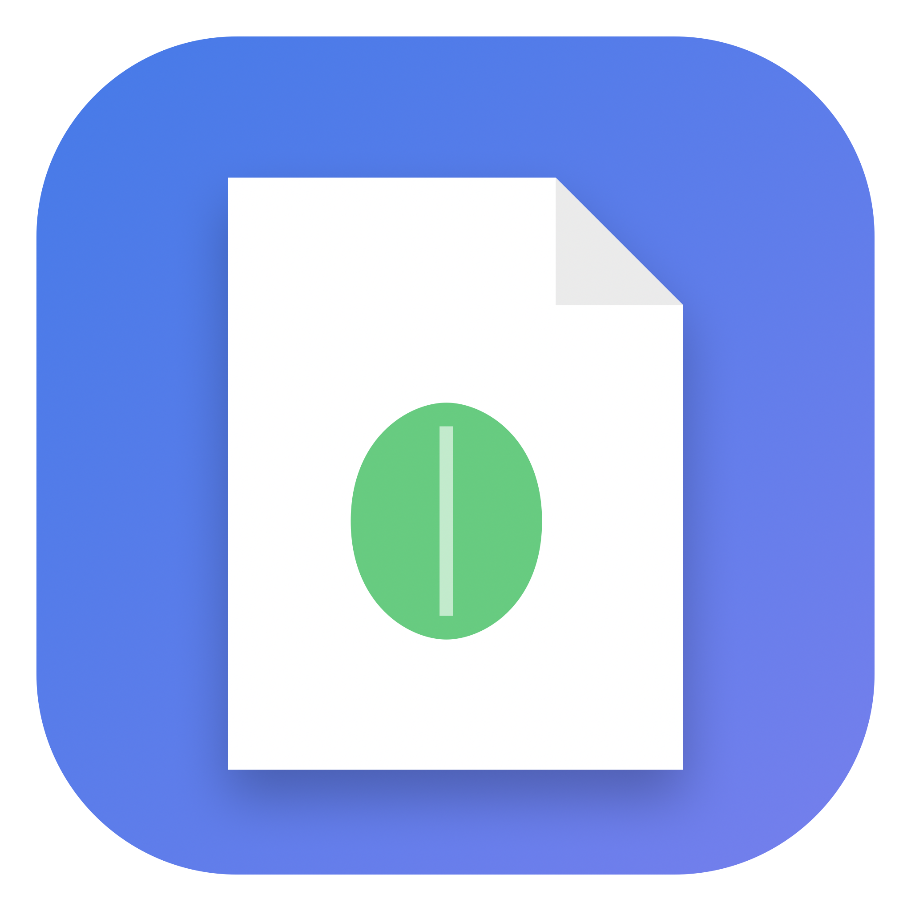
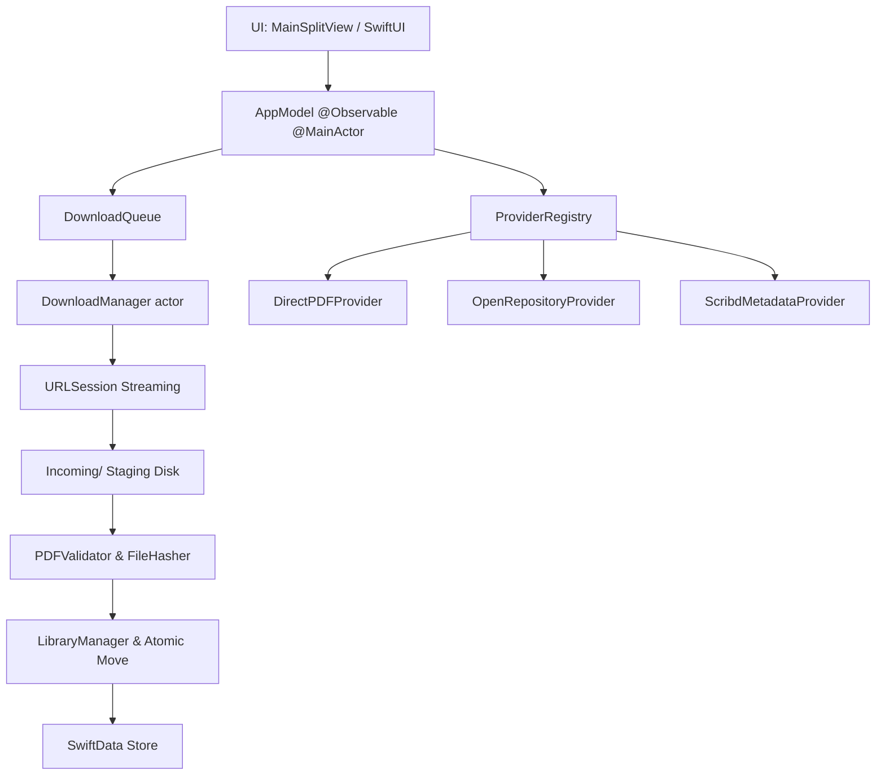

<div align="center">



# Folium
### *Encuentra. Obtén. Organiza.*

**La utilidad documental nativa, rápida y privada para macOS.**

[](https://apple.com)
[](https://swift.org)
[](https://developer.apple.com/xcode/swiftdata/)
[](https://developer.apple.com)
[](LICENSE)

<br />

[Características](#-características-principales) •
[Arquitectura](#-arquitectura-interna) •
[Guía de Uso](#-flujo-de-usuario-progressive-disclosure) •
[Compilación](#-compilación-y-ejecución) •
[Seguridad](#-privacidad-y-seguridad)

<br />

</div>

---

## 🍃 ¿Qué es Folium?

**Folium** es una aplicación macOS diseñada bajo los más rigurosos principios del diseño nativo de Apple (*Human Interface Guidelines* y *Progressive Disclosure*). 

Transforma el proceso habitualmente ruidoso y complejo de gestionar documentos y enlaces web en una experiencia elegante, silenciosa y en dos pasos:

```
URL ──> Reconocer ──> Obtener ──> Validar ──> Catalogar ──> Biblioteca
```

En la superficie, es una utilidad extraordinariamente simple: **pegar enlace, confirmar portada y leer el PDF**. Internamente, ejecuta un motor de inspección de red, resolución de recursos públicos, streaming a staging temporal, validación de integridad criptográfica y catalogación reactiva en SwiftData.

---

## ✨ Características Principales

<table>
  <tr>
    <td width="50%">
      <h3>🎯 Flujo de 2 Pasos</h3>
      <p>Al pegar un enlace, Folium inspecciona silenciosamente el recurso y extrae título, autor, tamaño y portada sin iniciar descargas pesadas accidentales. Tú confirmas con un solo clic.</p>
    </td>
    <td width="50%">
      <h3>📂 Biblioteca Dual</h3>
      <p>Alterna entre la vista <b>▦ Portadas</b> (miniaturas renderizadas con QuickLook/PDFKit estilo iBooks) y <b>≡ Lista</b> con metadatos técnicos, marcas de favoritos y fecha.</p>
    </td>
  </tr>
  <tr>
    <td width="50%">
      <h3>🔍 Inspector Técnico (⌥⌘I)</h3>
      <p>Mantén la interfaz limpia. Cuando necesites diagnosticar una transferencia, abre el inspector lateral para examinar encabezados HTTP, ETags, Server, hashes SHA-256 y el timeline de eventos.</p>
    </td>
    <td width="50%">
      <h3>🛡️ Deduplicación Criptográfica</h3>
      <p>Cada documento procesado calcula su hash SHA-256 en bloques de 64 KB vía CryptoKit. Si descargas un archivo existente, Folium evita duplicar almacenamiento innecesariamente.</p>
    </td>
  </tr>
  <tr>
    <td width="50%">
      <h3>🧭 Barra Lateral Organizada</h3>
      <p>Secciones semánticas para <b>Bandeja</b> (Biblioteca, Descargas activas, En cola, Terminados, Errores) y <b>Colecciones</b> (Favoritos).</p>
    </td>
    <td width="50%">
      <h3>⚡ MenuBarExtra & Atajos</h3>
      <p>Captura enlaces directamente desde la barra de menú o mediante atajos macOS estándar (<code>⌘N</code>, <code>⇧⌘V</code>, <code>⌘O</code>, <code>⌘F</code>, <code>⌥⌘I</code>, <code>Space</code>).</p>
    </td>
  </tr>
</table>

---

## 🏛️ Arquitectura Interna

Folium está construido sobre una arquitectura desacoplada por capas:



- **Presentación (`Folium`):** `NavigationSplitView` de 3 columnas, `MenuBarCompanionView` y ventana nativa de `Settings` con `TabView`.
- **Núcleo de Dominio (`FoliumCore`):** Máquina de estados explícita (`DocumentJob`, `DocumentState`), streaming de red y proveedores de resolución.
- **Persistencia (`SwiftData`):** Esquema estructurado (`DocumentRecord`, `DownloadRecord`, `ProviderRecord`) con fallback a memoria en caso de contingencia.
- **Almacenamiento Local:** `SecurityScopedFolderManager` para preservar permisos a carpetas de usuario seleccionadas fuera del sandbox.

---

## 🔒 Privacidad y Seguridad

Folium está concebido con un estándar intransigente de privacidad y cumplimiento:

- 🛡️ **App Sandbox Verificado:** La aplicación se ejecuta con privilegios mínimos (`ENABLE_APP_SANDBOX = YES`).
- 🔐 **Hardened Runtime:** Protección contra inyección de código y manipulación en tiempo de ejecución (`ENABLE_HARDENED_RUNTIME = YES`).
- 🚫 **Sin Rastreo ni Telemetría:** Cero llamadas a servicios de analítica de terceros. Tu historial y tus documentos jamás salen de tu Mac.
- ⚖️ **Cumplimiento Ético:** Folium no elude DRM, no evade paywalls, no resuelve CAPTCHAs automáticamente ni almacena credenciales ajenas. Clasifica recursos restringidos con honestidad técnica.

---

## ⌨️ Atajos de Teclado Nativos

| Atajo | Acción |
|---|---|
| <kbd>⌘</kbd> + <kbd>N</kbd> | Nueva captura / descarga |
| <kbd>⇧</kbd> + <kbd>⌘</kbd> + <kbd>V</kbd> | Pegar del portapapeles y analizar de inmediato |
| <kbd>⌘</kbd> + <kbd>O</kbd> | Abrir documento seleccionado en la app por defecto |
| <kbd>⌘</kbd> + <kbd>F</kbd> | Enfocar la búsqueda en la biblioteca |
| <kbd>⌥</kbd> + <kbd>⌘</kbd> + <kbd>I</kbd> | Mostrar / Ocultar Inspector técnico |
| <kbd>Espacio</kbd> | Vista rápida del documento |
| <kbd>⌘</kbd> + <kbd>,</kbd> | Abrir Ajustes de Folium |

---

## 🛠️ Compilación y Ejecución

### Requisitos Previos
- macOS 14.0 (Sonoma) o superior.
- Xcode 15.0+ o Xcode 16.
- Apple Silicon (`arm64`) nativo (soporta también binarios universales).

### Clonar y Compilar

```bash
# 1. Clonar el repositorio
git clone https://github.com/AtelierMinuit/Folium.git
cd Folium

# 2. Ejecutar la suite de pruebas
swift test

# 3. Compilar la aplicación Release con xcodebuild
xcodebuild -scheme Folium -configuration Release build CONFIGURATION_BUILD_DIR="$(pwd)/build"

# 4. Abrir la aplicación resultante
open build/Folium.app
```

También puedes abrir directamente `Folium.xcodeproj` en Xcode y presionar <kbd>⌘</kbd> + <kbd>R</kbd>.

---

## 🧪 Pruebas Automatizadas

Folium incluye una batería exhaustiva de pruebas unitarias y de integración end-to-end con un servidor local mock escrito en Python (`Tests/Fixtures/Server/test_server.py`):

```bash
swift test
```
*Cobertura: Validación de PDFs corruptos/válidos, normalización de URLs, detección de duplicados por hash, retries con backoff, seguimiento de redirects y persistencia SwiftData.*

---

## 📄 Licencia

Este proyecto está disponible bajo la licencia **MIT**. Consulta el archivo [LICENSE](LICENSE) para más detalles.

<div align="center">
  <sub>Diseñado y desarrollado con precisión artesanal para macOS.</sub>
</div>
